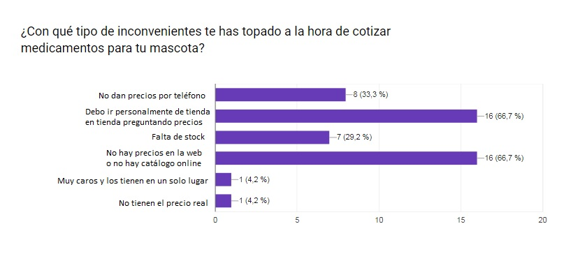
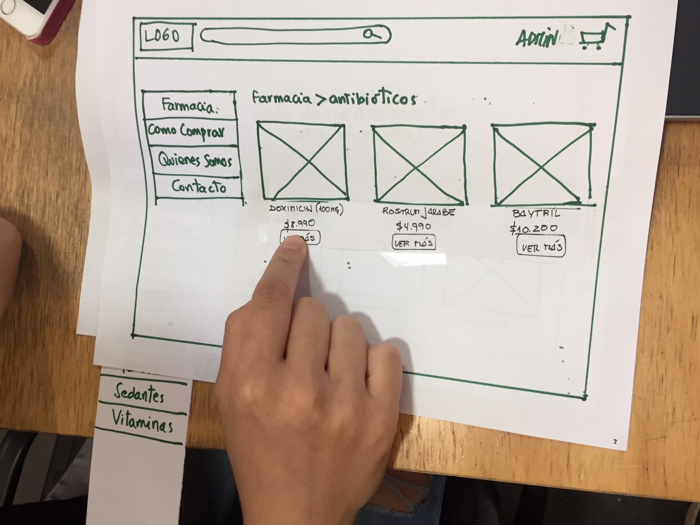
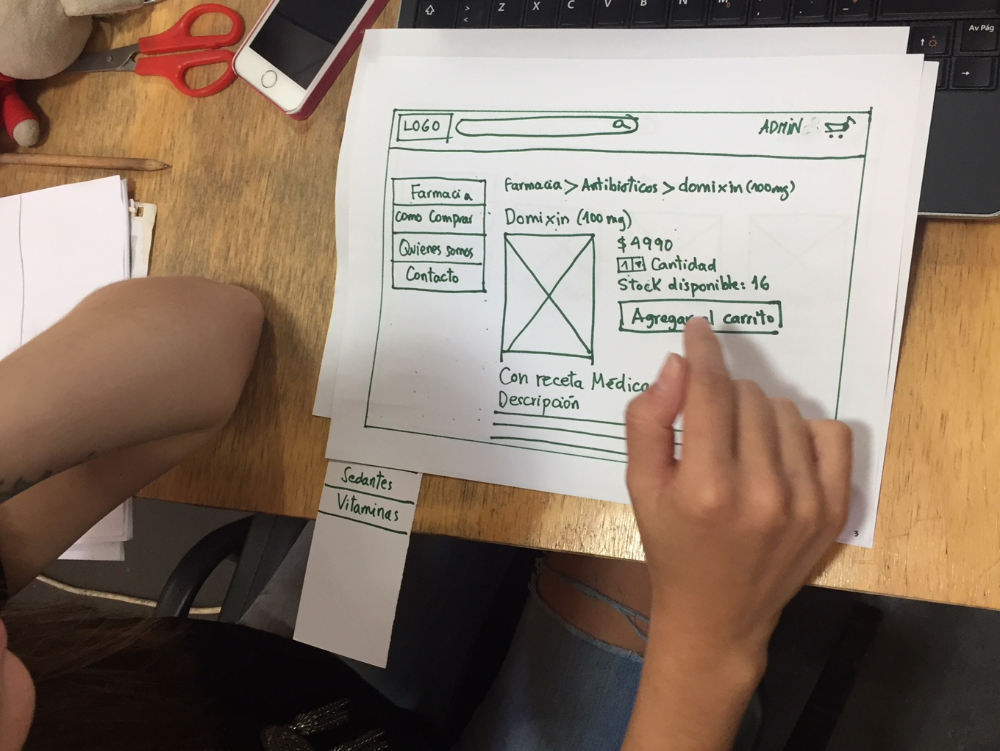
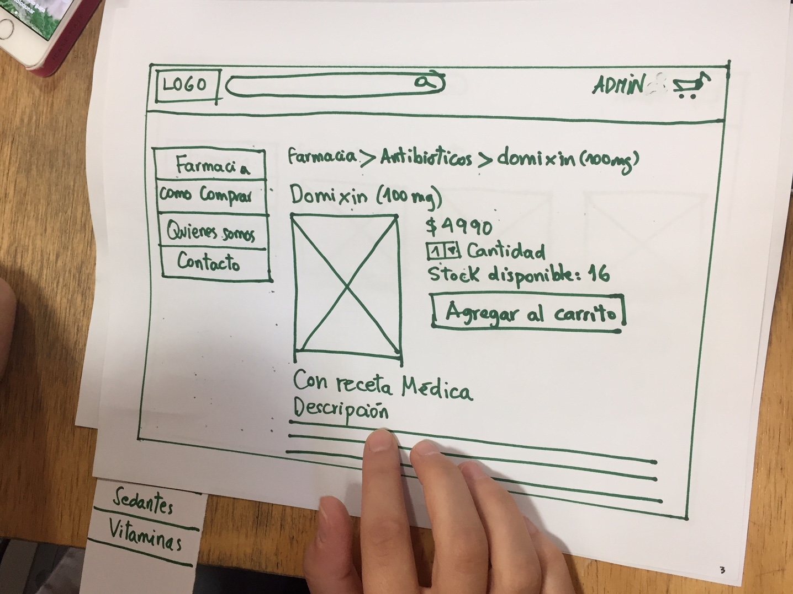

# Farmapet

Es un catálogo online de venta de medicamentos para mascotas.

Lo que a continuación se presenta es el MVP

## Descubrimiento e Investigación

### User Research
#### Encuestas y entrevistas

Comenzamos haciendo encuestas online para averiguar los comportamientos de compra de los usuarios.

Cuando sus mascotas son llevadas al veterinario y les recetan medicamentos, el 45,7% prefiere comprar en el mismo lugar, por lo práctico, sabiendo que quizás no sea lo más conveniente al bolsillo. 
Por otro lado, el mismo porcentaje prefiere comprar después y cotizar, con el fin de ahorrar.
Hay otro pequeño porcentaje, un 2,9% que prefiere comprar a través de páginas web de petshops, y el mismo porcentaje para personas que compran dependiendo de la situación: "depende, si noto que mi mascota está muy mal las compro en el mismo lugar por un tema de apuro, pero si no, yo prefiero cotizar".

Ante la pregunta "¿Conoces alguna página web dónde cotizar medicamentos online?", un 82,9% respondió negativamente y solo un 17,1% respondió que sí.

La tercera pregunta iba destinada a averiguar cuáles son los problemas reales de la búsqueda de medicamentos. Por mayoría los más frecuentes son que deben ir personalmente de tienda en tienda preguntando por precios, y que no existe en la web un lugar donde cotizar. Les sigue la traba que no dan precios por teléfono.

Estos factores toman relevancia, ya que influyen en la desición de cómo comprar y afecta directamente a un público no menor, que no puede darse el lujo de perder dinero por no cotizar antes. 

En esta investigación pudimos también identificar a otro público, mucho más específico, que son los dueños de mascotas que sufren enfermedades crónicas y que deben consumir medicamentos de por vida, el que corresponde a un 34,3% de los encuestados. Esto implica un gasto fijo mensual, y en general ese valor no es tan bajo como quisieran. Algunas de estas enfermedades, mencionadas por los propios afectados, son: distemper, tumores, artrosis, hipotiroidismo, epilepsia, gingivitis estomatitis, hipertensión, déficit de potasio e insuficiencia cardiaca.

Entrevistamos a Johanna Olavarría, veterinaria y Directora de la Fundación VYRA. Nos comentó que si bien mucha gente compra en la misma clínica (si es que ésta tiene los medicamentos), hay otro público importante, de menos presupuesto, que prefiere comprar en otro lugar y primero estudiar detenidamente los precios. El motivo de esto, sin considerar un presupuesto limitado, ocurre también cuando son muchos remedios los que se recetan, y al ser una lista larga, la gente prefiere averiguar bien antes, ya que la diferencia de precio puede ser bastante alta. Ocurre también en casos donde el veterinario va a domicilio, aquí usualmente las atenciones no son de urgencia, por lo tanto no requieren de su medicina de forma inmediata y los dueños optan también por cotizar. 

#### Análisis de mercado

Investigamos en internet si es que existen plataforma de venta de medicamentos, con catálogo, descripción y precios, y descubrimos dos casos de venta web, pero ambos tienen falencias.

El primer caso es arkanet.cl, en donde efectivamente tienen un catálogo y algunos de sus productos se venden bajo receta médica. En este caso, para el usuario, el flujo de compra es el tradicional: se escoge el producto, se agrega al carrito, y paga. El inconveniente está a la hora de exigir la receta médica, ésta debe ser enviada aparte, vía whatsapp. Si un usuario quisiera "engañar" al sistema, o si se equivoca, y no entrega receta, puede realizar el pago igual, pero la tienda no entregaría el medicamento ya que estaría faltando a la ley. Ahí se iniciaría un protocolo de devolución de dinero, que implica pérdida de tiempo. Conclusión: el proceso de venta online debería permitir el envío del documento en ese mismo momento.

El segundo caso es puntomascotas.cl, pero en su catálogo no tienen productos con receta, por lo que la variedad es muy limitada. Los medicamentos (como tal) que venden son algunos antibióticos, antiinflamatorios y gotas. El resto de los productos son de uso común y se encuentran en la mayoría de los petshop.

Existen otras webs de famacias veterinarias, o de clínicas veterinarias que tienen una sección llamada "farmacia", que venden estos productos, pero sin catálogo. Es decir, venden solo en la tienda, y la sección web se limita a un texto informativo donde cuentan qué tipo de medicamentos son los que venden, las marcas o los horarios de atención de la tienda.

#### Definición del problema

En conclusión, los usuarios consultados presentan los siguientes problemas:

* Deben recorrer local por local en busca del medicamento y consultando en persona por el valor. Esto tiene varios motivos: principalmente porque la oferta de sitios web donde cotizar es muy reducida (encontramos solo uno), porque en algunos lugares se niegan a dar precios por teléfono y por falta de stock, lo que se traduce en un gasto de tiempo importante.
* Algunos usuarios tienen mascotas con enfermedades crónicas, en donde deben hacer un gasto mensual fijo, que afecta directamente al presupuesto.

Definimos que la solución sería una web responsive con el valor agregado de que el usuario tenga a completa disposición un catálogo, con precios reales, de medicamentos veterinarios, stock, con servicio de compra online y despacho dentro de 24 hrs. Esto permite ahorrar tiempo cotizando, saber de inmediato los valores, y con la fluidez de servicio permitiendo adjuntar la receta durante el proceso de compra, ahorrando trámites post venta por solicitud de devolución de dinero. Además ayuda a que haya más oferta, donde la gente comience a buscar este tipo de productos por internet, fomentando la sana competencia de precios.

Por otro lado, el desafío planteaba la existencia de dos usuarios del sitio: el que compra y el administrador del catálogo. Con respecto a este último, su interacción debe ser tener un acceso privado (login) a varios formularios donde pueda agregar, editar, eliminar o actualizar productos. Por ello definimos que la interfaz del administrador debe contar con una usabilidad adecuada, pocos pasos para realizar las tareas, y en un lenguaje cercano, con herramientas de uso común para que pueda deducir fácilmente cómo editar el catálogo.

#### User personas

Con todas estas situaciones que pudimos identificar, nos quedamos con 2 user personas:

Los "puntos de dolor" de Ivonne son que tiene un perro enfermo que depende de medicamentos diariamente. Su presupuesto es acotado y debe buscar lo más económico. Además las pastillas a veces no están en stock y debe pasearse de lugar en lugar buscándolas, a veces contra el tiempo ya que su perro no puede estar sin el tratamiento.

Jorge tiene otro problema diferente al de Ivonne: tiene 8 perros, y si uno se enferma, se contagian todos o casi todos, por lo que un tratamiento se multiplica y encarece los gastos. Además en la zona donde vive no tiene donde comprar. Hay petshops contados con los dedos de una mano, tienen poca variedad y la que hay es excesivamente cara por ser los únicos que venden. 

### Wireframes

Realizamos dos flujos de navegación con wireframes, uno del cliente que compra, y otro del administrador de la página.
Nos preocupamos de diseñar una interfaz sencilla, intuitiva, y testeamos con usuarios. Los comentarios fueron positivos, usamos un lenguaje de herramientas universal, para que quienes hagan uso del sitio no se cuestionen las acciones.

Y desde el proceso de wireframes transmitimos directamente esta información al equipo de front-end, para que pudieran empezar a codear la maqueta del sitio. Desde el principio las propuestas fueron bien aceptadas y constantemente había feedback de un lado a otro sobre la usabilidad.
